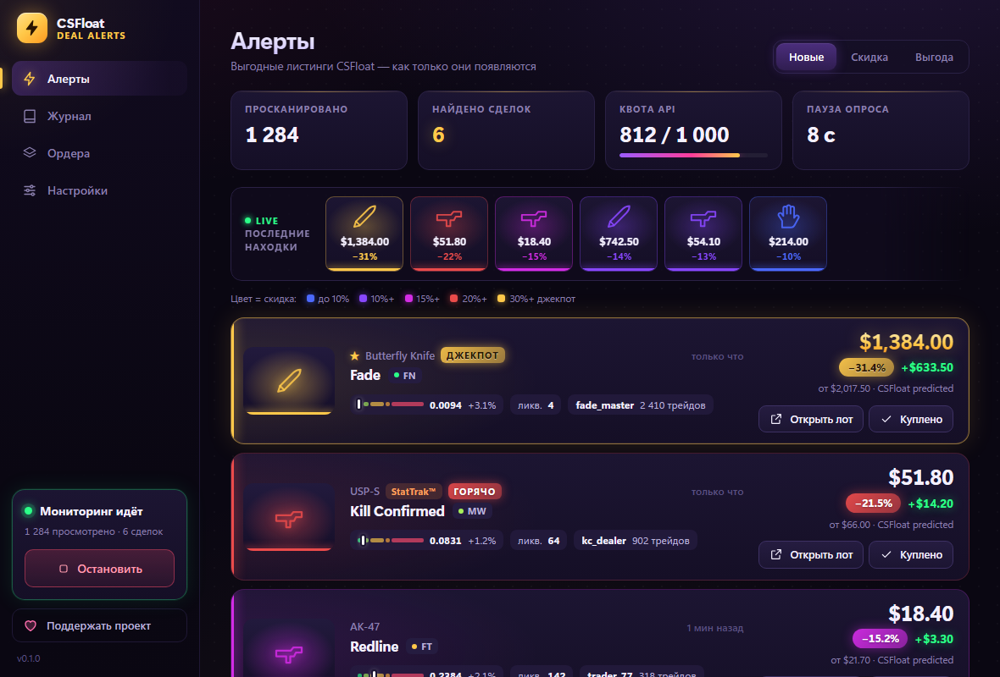
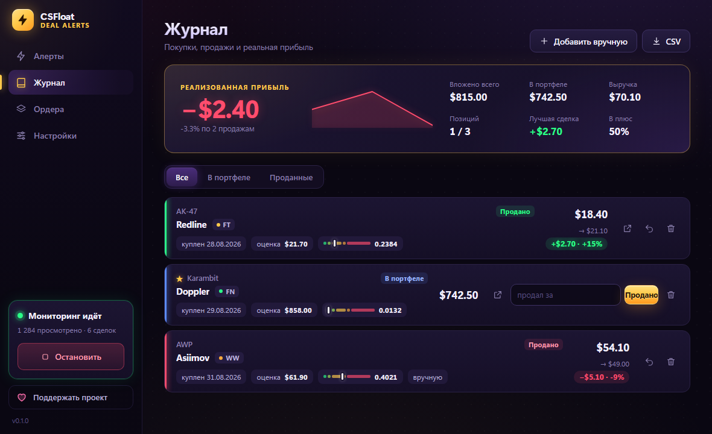
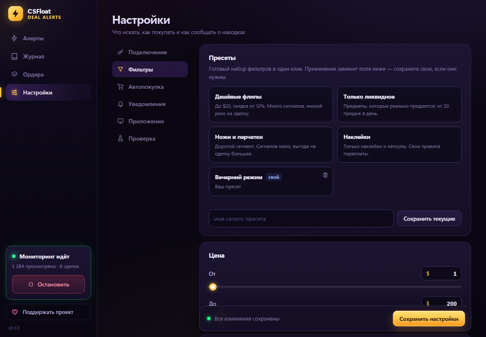
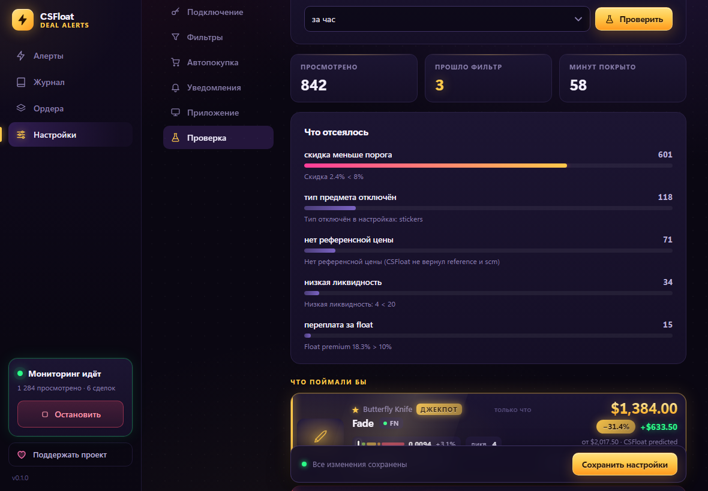
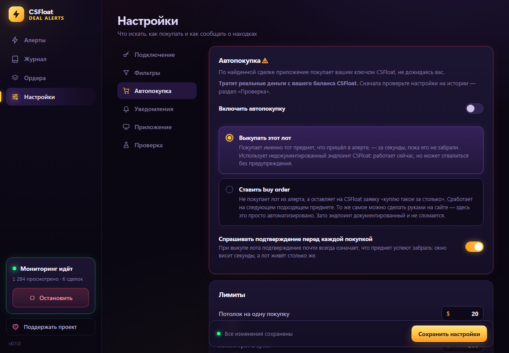

# CSFloat Deal Alerts

Программа для Windows, которая следит за новыми лотами на CSFloat и сразу
показывает те, что выставлены заметно дешевле обычной цены. Хорошие лоты
обычно уходят за секунды, руками за ними не успеть. Она ловит их в первые
мгновения и кидает уведомление.

Бесплатно и работает прямо на вашем компьютере. Ключ CSFloat
никуда, кроме самого CSFloat, не отправляется.



Цвет карточки показывает, насколько лот дешевле рынка: синий — до 10%,
фиолетовый, розовый, красный — дальше больше, а золотой «Джекпот» — от 30%.

<details>
<summary>Ещё скриншоты: журнал, фильтры, проверка, автопокупка</summary>









</details>

## Как начать

1. Скачайте программу в [Releases](../../releases). `Setup` ставится как обычно,
   `portable` запускается без установки.
2. При первом запуске Windows может показать «Windows защитила ваш компьютер».
   Это потому, что у программы нет платной подписи. Нажмите «Подробнее»,
   потом «Выполнить в любом случае».
3. На csfloat.com откройте Profile → Developer → New Key и скопируйте ключ.
4. В программе зайдите в «Настройки» → «Подключение», вставьте ключ и нажмите
   «Запустить».

Всё. Дальше программа сама раз в 8 секунд смотрит свежие лоты. Найденное
появляется карточками, а в углу экрана выскакивает уведомление: нажали на него,
и лот уже открыт.

## Что настраивается

Цена от и до, какая скидка вас интересует (по умолчанию от 8%) и сколько
минимум хочется заработать в долларах. Можно отсеять старые лоты, продавцов без
истории, вещи, которые почти не продаются, и переплату за float или наклейки.
Можно выбрать типы предметов или вообще следить за одним конкретным скином.

Разбираться во всём сразу не обязательно: есть готовые наборы — дешёвые флипы,
только ликвидное, ножи и перчатки, наклейки, широкий поиск. Свой вариант тоже
сохраняется в один клик.

Перед запуском загляните в «Проверку». Программа прогонит ваши фильтры по лотам
за последний час и покажет, что бы поймала и какой фильтр режет больше всего.
Ничего при этом не покупается.

Скидка считается от оценки самого CSFloat (она учитывает float), а если её нет,
то от цены в Steam. Никаких других сервисов и платных ключей не нужно.

## Автопокупка

Она выключена, и включать её стоит, только когда вы уже проверили фильтры: эта
функция тратит настоящие деньги с вашего баланса на CSFloat.

Есть два режима. «Выкупать этот лот» покупает именно то, что пришло в алерте,
за пару секунд. Для этого используется недокументированный метод CSFloat: пока
он работает, но его могут закрыть без предупреждения. «Ставить buy order»
оставляет на CSFloat заявку «куплю такое не дороже вот столько». Это официальный
способ, но купится уже следующий подходящий лот, а не тот, что вы видите.

Чтобы случайно не спустить баланс, есть потолок на одну покупку и лимит на день
(обнуляется в полночь). Программа спрашивает подтверждение перед каждой
покупкой и не берёт один и тот же предмет чаще раза в полчаса. Покупки идут по
одной, никогда не параллельно. Нажали «Стоп» — автопокупка тоже встала.

## Уведомления в Telegram

Если компьютер работает дома, а вы нет, алерты можно получать в Telegram.
Создайте бота у @BotFather, вставьте его токен и свой chat id в «Настройки →
Уведомления» и нажмите «Отправить тест». Токен хранится в настройках без
шифрования, поэтому лучше завести отдельного бота только под это.

## Журнал

Купили что-то из алерта — нажмите «Куплено», и позиция попадёт в журнал. Когда
продадите, впишите сумму, которая реально пришла после комиссии, и программа
посчитает прибыль. Считается она только по проданному, так что непроданные
скины не рисуют вам минус. Есть выгрузка в CSV, если хотите считать в Excel.

## Где лежат данные

Всё хранится в `%APPDATA%\csfloat-deal-alerts\`: настройки, журнал, история
находок и ключ. Ключ зашифрован средствами Windows, просто скопировать его на
другой компьютер не выйдет. Если удалить программу, данные останутся, так что
переустановка журнал не потеряет. А если какой-то файл вдруг повредится, рядом
останется его копия с пометкой `.corrupt`.

Автозапуск вместе с Windows работает только у установленной версии. Portable
каждый раз распаковывается заново во временную папку, и Windows её не находит.

## Пара предупреждений

Не ставьте опрос чаще раза в 5 секунд. С домашнего IP CSFloat начнёт отвечать
ошибкой 429. Программа сама притормозит, но лучше до этого не доводить.

Прибыль программа не гарантирует. Она просто замечает дешёвые лоты быстрее
человека, а покупать или нет — решаете вы. Это неофициальный инструмент, с
CSFloat и Valve он никак не связан.

## Поддержать

Программа бесплатная. Если она помогла вам заработать и хочется сказать
спасибо, реквизиты лежат в [SUPPORT.md](SUPPORT.md) (USDT, сеть
TRC-20). В самой программе для этого есть кнопка «Поддержать проект».

## Для разработчиков

```bash
npm install
npm start          # запуск из исходников
npm run check      # тесты логики
npm run dist       # сборка установщика и portable
```

Движок можно погонять и без окна: `CSFLOAT_API_KEY=... npm run dev:engine`.
Логика поиска лежит в `app/engine` и от Electron не зависит, всё системное
(окно, трей, уведомления, ключ) — в `app/main`, интерфейс — в `app/renderer`.

## Лицензия

[PolyForm Shield 1.0.0](LICENSE). Пользоваться, менять под себя и делиться можно.
Продавать программу или делать на её основе конкурирующий продукт нельзя.
